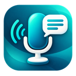
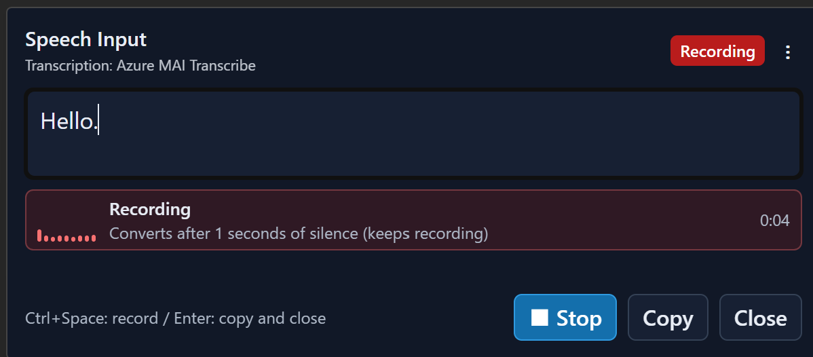
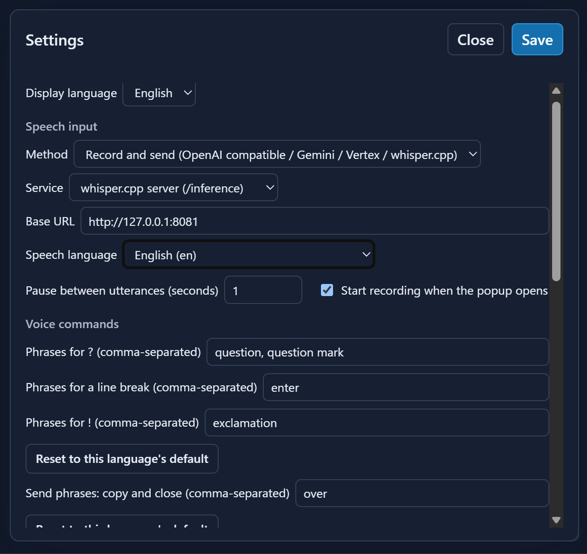
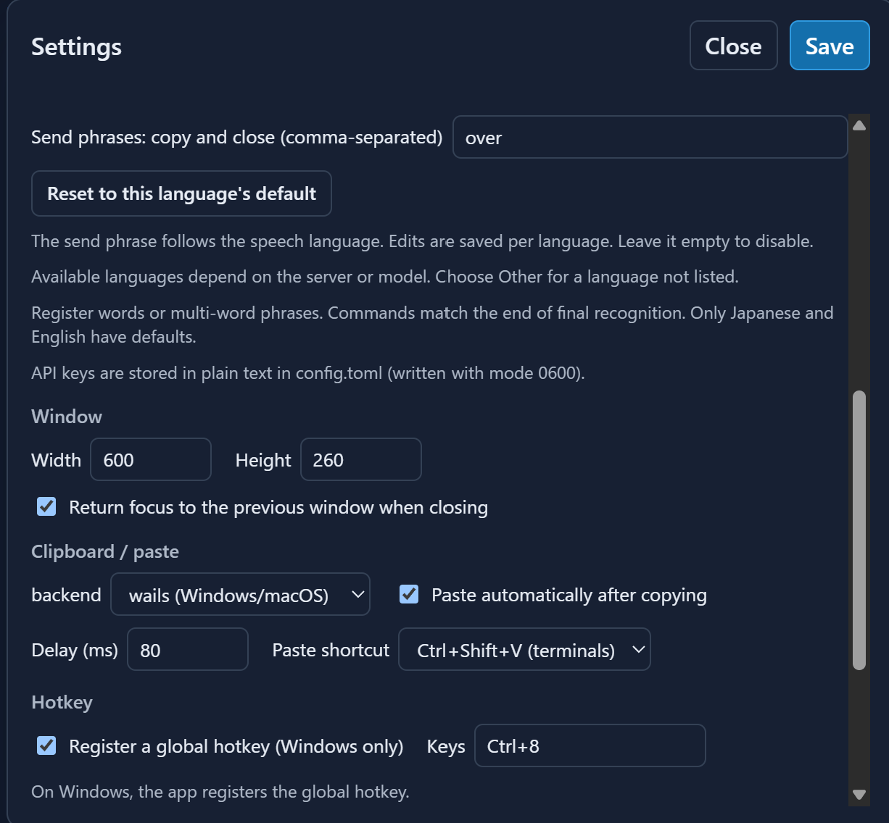
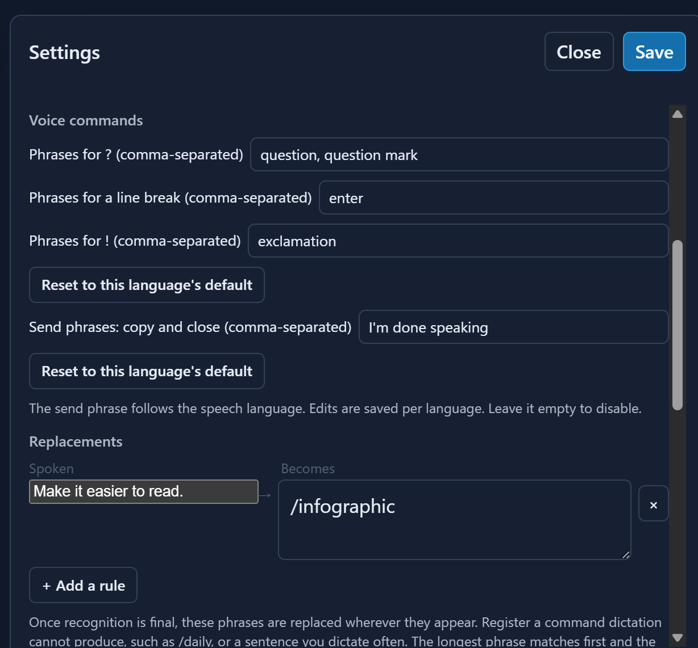

# speech-popup

[日本語](README_ja.md) · [Privacy](PRIVACY.md)

A resident voice dictation popup built with Wails. Press a hotkey, speak, edit the transcript, and press Enter to copy it and paste into the previous window.



The interface, help, settings and native tray menu support **English and Japanese**. Choose **Display language → English / 日本語** in Settings and save to apply it immediately. Before a language is saved, the initial selection follows the WebView language (Japanese for Japanese locales, English otherwise). The speech recognition language is a separate setting.

This project adapts the resident popup and clipboard workflow from [skk-popup](https://github.com/takeshy/skk-popup) and speech input from [gemihub-desktop](https://github.com/takeshy/gemihub-desktop).

## Demo



[Watch the demo on YouTube](https://youtu.be/CVzQ8gJrPJA)

### Settings

<p>
  
  
</p>

#### Replacement rules

Replacement rules turn a spoken phrase into text that is difficult or impossible to dictate directly, such as `/daily`. Add one row per phrase in Settings; the detailed matching behavior is described under [Remembered service settings](#remembered-service-settings).



## Speech services

| Service | Configuration | Authentication |
|---|---|---|
| Browser speech recognition | `provider = "browser"` | WebView-dependent |
| OpenAI Live | `provider = "live"`, `endpoint_type = "openai"` | Your API key; `gpt-live-transcribe` |
| Gemini Live | `provider = "live"`, `endpoint_type = "gemini-transcribe"` | Your API key; `gemini-3.5-transcribe-live` |
| OpenAI | `endpoint_type = "openai"` | Your API key |
| OpenAI compatible / self-hosted | `endpoint_type = "custom"` | As required by your server |
| whisper.cpp server | `endpoint_type = "whisper-cpp"` | Local server; no model field required |
| Azure MAI Transcribe | `endpoint_type = "azure-mai-transcribe"` | Azure Speech API Key |
| Gemini API | `endpoint_type = "gemini-transcribe"` | Your API key |
| Vertex AI | `endpoint_type = "vertex-transcribe"` | Google OAuth desktop client and Cloud project |

The default is browser recognition, but **WebKitGTK and many WebView2 installations do not provide a working recognition backend**. If unavailable, open Settings and choose a recording-based service. Cloud accounts, API usage charges and local models are not included with the app.

Recording-based services receive 16 kHz mono WAV audio through the Go backend, avoiding WebView CORS issues. Each recording session is limited to five minutes, with up to 20 MB of queued audio. The Vertex binding only attaches OAuth credentials to its fixed model endpoint.

## Requirements

- **Windows 10/11:** microphone and Microsoft Edge WebView2 Runtime. In-app global hotkeys are supported.
- **Linux/Wayland:** WebKit2GTK 4.1, `wl-copy`, a microphone, and optionally `wtype` for automatic paste. Hyprland is the primary supported compositor.
- **macOS:** microphone permission; focus restoration and paste use `osascript` and require the corresponding Accessibility/Automation permissions.

The Windows version is available from the [Microsoft Store](https://apps.microsoft.com/detail/9NVCCG9K20FV).

## Everyday use

1. Start the app. It stays in the notification area with a microphone icon.
2. Press **Ctrl+8** (Windows default), or choose Open speech input from the tray menu.
3. Speak. Recording starts on opening by default. Pauses segment speech for transcription while recording continues. Ctrl+Space stops recording.
4. The final transcript applies configured **replacement rules** before it appears (for example, `daily note` → `/daily`), and remains editable.
5. Press **Enter** to copy, close and paste into the previous window.
6. Alternatively, end with a configured send phrase (defaults follow the speech language, such as `I'm done speaking` for English) to remove that phrase and copy/close automatically.

The header displays the current transcription service. The tray menu provides Settings, Help and Quit even if the hotkey fails.

### Keyboard shortcuts

| Keys | Action |
|---|---|
| Ctrl+Space | Start recording / stop and transcribe |
| Ctrl+R | Retry the retained recording |
| Ctrl+D | Discard retained audio |
| Enter / Shift+Enter | Copy and close / insert newline |
| Ctrl+A / Ctrl+E | Start / end of line |
| Ctrl+B / Ctrl+F | Move left / right |
| Ctrl+K / Ctrl+U | Delete to end / start of line |
| Ctrl+O | Select all |
| Ctrl+C / Ctrl+X / Ctrl+V | Copy / cut / paste |
| Ctrl+Z | Undo |
| Ctrl+Shift+Z / Ctrl+Y | Redo |
| Ctrl+↑ / Ctrl+↓ | Browse history / return to draft |
| Escape / Ctrl+[ | Cancel active recording/transcription, otherwise close and keep the draft |

Ctrl+K at the end of a line removes the newline and joins the next line. Editing keys match skk-popup. Ctrl+A means **start of line**; use Ctrl+O for select all.

A failed transcription retains its audio for Retry, including while you open Settings or correct credentials/endpoints. Retry sends that audio in a new request; starting a new recording discards the failed audio and sends only the new clip. Switching between browser and recorded recognition also discards it. Retry audio is kept in memory, not across app restarts. A successful transcription consumes the retained recording; copying clears the text and remaining audio.

Text history keeps the latest 30 unique entries and survives restarts. When the popup reopens, it saves the previous text to history even if you never copied it, and clears the input for a new entry. Use Ctrl+↑ / Ctrl+↓ to retrieve it. External clipboard text is also captured on opening. A draft that has not yet been copied or archived is only kept in memory until exit.

### Windows startup

The MSIX package registers a startup task. After installing/updating and launching once, the app starts on subsequent Windows sign-ins. Enable or disable it in **Settings → Apps → Startup → speech-popup**. A previously disabled task must be re-enabled there.

For a standalone EXE, place a shortcut in `shell:startup` (Win+R). For an installed Store app, drag its entry from `shell:appsfolder` into `shell:startup` if using a version without a startup task.

### Linux / Hyprland

Register the hotkey with the compositor; the app does not register Linux hotkeys:

```ini
windowrulev2 = float, class:^(speech-popup)$
windowrulev2 = center, class:^(speech-popup)$
windowrulev2 = pin, class:^(speech-popup)$
windowrulev2 = stayfocused, class:^(speech-popup)$
windowrulev2 = noborder, class:^(speech-popup)$
windowrulev2 = noanim, class:^(speech-popup)$
bind = CTRL, 8, exec, speech-popup show
exec-once = uwsm app -- speech-popup
```

Check the actual class with `hyprctl clients`. Settings can generate a bind line for your chosen shortcut. On macOS, use an OS shortcut tool to run `speech-popup show`.

## Configuration

Open **⋮ → Settings**. Changes take effect without restarting. The config file is:

- Linux: `~/.config/speech-popup/config.toml` (or `$XDG_CONFIG_HOME`)
- Windows: `%AppData%\speech-popup\config.toml`
- macOS: `~/Library/Application Support/speech-popup/config.toml`

```toml
[window]
width = 600
height = 300
restore_focus = true

[speech]
provider = "browser" # or "live", or "openai-compatible" for recorded services
endpoint_type = "openai"
base_url = "https://api.openai.com/v1"
api_key = "" # stored in plain text
model = "whisper-1"
language = "auto" # speech language, not the UI language
silence_seconds = 3 # 0 disables silence detection
send_phrase = "これで終わります"
replacements = "日記書いて => /daily" # one rule per line, for text you cannot dictate
vertex_project_id = ""
auto_start = true

[clipboard]
backend = "wails" # Windows/macOS; Linux defaults to "wl-copy"
auto_paste = true
auto_paste_delay_ms = 80
paste_key = "ctrl+v" # use ctrl+shift+v for terminals

[hotkey]
enabled = true # Windows only; false by default elsewhere
accelerator = "Ctrl+8"
```

### Remembered service settings

Choose **Live transcription** to use `gpt-live-transcribe` with OpenAI or `gemini-3.5-transcribe-live` with the Gemini API. Interim text is shown in the editor; replacements, voice commands, and the copy-and-close phrase run only on final text. Live Base URLs and models are fixed, and an API key is required. The Go backend owns the connection and credentials, so the key is not placed in the WebSocket URL.

Settings remembers each service's **Base URL, API Key, Model, language, and Vertex project ID**. Switching services restores its previous values; a service used for the first time starts with its defaults and an empty key. Choose **Save** to persist all service profiles in `config.toml` across app restarts. Closing without saving discards edits. Silence duration, automatic recording and the replacement rules remain shared settings.

**Speech language** is a dropdown with service-specific codes and native language names alongside the UI language. OpenAI uses the documented Whisper language suggestions, whisper.cpp uses its language catalog, Gemini/Vertex use regional codes, and Azure MAI uses its model's language list. Browser and self-hosted support depends on the installed engine/model. Choose **Other (language code)** for unlisted languages; existing codes are preserved. Automatic detection remains available for HTTP services; the browser option uses the WebView language.

**Voice commands** have four editable targets: **?**, **line break**, **!**, and **copy and close**. Settings remembers phrases per speech language and restores them when you switch languages or services. Defaults are provided only for Japanese (クエスチョン / クエスチョンマーク, エンター, びっくり, これで終わります) and English (question / question mark, enter, exclamation, I'm done speaking). Other languages start empty. Existing saved phrases are retained.

**Replacements** rewrite recognized text once it is final. Each rule is a row of two fields in Settings - the spoken phrase, and what it becomes - with **+ Add a rule** and a **×** on each row. They exist for text dictation cannot produce: `/daily` is unsayable in Japanese, so a rule from `日記書いて` to `/daily` lets the sentence be spoken and the command be pasted. A replacement may also be a whole sentence, including line breaks. The longest phrase matches first, every occurrence is replaced, and the rest of the dictation follows the replacement, so "daily note today it rained" becomes "/daily today it rained". Punctuation the recognizer adds right after the phrase is consumed with it, so a phrase spoken as a sentence still yields `/infographic` rather than `/infographic。`, and one space separates the replacement from whatever follows. Latin phrases match whole words, case-insensitively; an empty replacement deletes the phrase. Rules are shared by all speech languages, are stored one per line in `config.toml` (line breaks inside a replacement are escaped), and are capped at 4000 characters in total.

Each field accepts words or multi-word phrases, with alternatives separated by commas: for example, `se acabo, se acabó`. Match the spelling the recognition service actually returns. An empty field disables that action; the reset buttons restore the current language's defaults. A phrase cannot be assigned to multiple actions. Changes are persisted on **Save**, including disabled commands. Regional variants share settings (Traditional Chinese is separate). When speech language is automatic, commands use the WebView's preferred language, not the detected language of each transcript.

The language catalogs in `frontend/src/speech_languages.js` were checked against [official OpenAI documentation](https://developers.openai.com/api/docs/guides/text-to-speech#supported-languages), [whisper.cpp](https://github.com/ggml-org/whisper.cpp/blob/master/src/whisper.cpp), [Gemini](https://ai.google.dev/gemini-api/docs/transcribe#supported-languages), [Vertex](https://docs.cloud.google.com/gemini-enterprise-agent-platform/models/gemini/3-5-transcribe), and [Azure MAI](https://learn.microsoft.com/en-us/azure/ai-services/speech-service/mai-transcribe#language-support).

### Local whisper.cpp

```sh
./build/bin/whisper-server -m models/ggml-large-v3-turbo.bin --host 127.0.0.1 --port 8080
```

Choose whisper.cpp server and set Base URL to `http://127.0.0.1:8080`. Loopback/private HTTP is allowed; direct link-local destinations are blocked by the transport.

### Azure MAI Transcribe

1. Create an Azure Speech / Foundry resource in a region that supports **MAI Transcribe**. Check the **LLM speech** tab in the [region table](https://learn.microsoft.com/en-us/azure/ai-services/speech-service/regions); ordinary speech-to-text support alone does not imply MAI support.
2. In Settings, select the recorded speech provider and **Azure MAI Transcribe**.
3. Enter the endpoint and key belonging to that resource, then save:

| Setting | Example / behavior |
|---|---|
| Base URL | `https://southeastasia.api.cognitive.microsoft.com/` for a Southeast Asia resource, or the resource's `https://your-resource.cognitiveservices.azure.com/` endpoint |
| API Key | The key for the same resource; changing only the URL does not move an existing resource |
| Model | `MAI-Transcribe-2` (default); `MAI-Transcribe-1.5` can also be specified |
| Language | `auto` for automatic detection, or `ja` for Japanese (`jp` is not the Japanese language code) |

Enter the base endpoint without an API path or query string. The app adds the [MAI Transcribe API](https://learn.microsoft.com/en-us/azure/ai-services/speech-service/mai-transcribe) path and API version `2025-10-15`. Language `auto` omits `locales`; `ja` sends `locales: ["ja"]`.

#### If recognition fails

- **HTTP 400 / enhanced mode with model is not supported:** check MAI support for the resource's region and endpoint. In our checks, the Japan East endpoint accepted ordinary fast transcription but rejected MAI; Southeast Asia successfully transcribed speech with `MAI-Transcribe-2`.
- **No speech was recognized:** the service returned an empty transcript. This does not by itself mean the language setting is wrong. Check that the microphone meter moves while speaking. Set **Pause between utterances (seconds)** to **0**, save, record about five seconds of speech, then stop manually with Ctrl+Space to test without automatic segmentation.
- **Retrying after a settings change:** Ctrl+R resends the retained audio with the saved settings. Changing the silence duration does not re-segment retained audio. To test a fresh recording, discard the retained audio with Ctrl+D first if you no longer need it.

Once manual recording works, try a pause of about **3 seconds** if you want automatic segmentation. A value of 0 disables automatic segmentation; question/Enter command conversion still works when you stop recording manually.

### Vertex AI

1. Create a Google Cloud OAuth client of type **Desktop app** and download its JSON.
2. Select Vertex AI in Settings, choose **Select JSON and connect to Google**, select the JSON and authorize in the browser.
3. Save settings. The project ID is read automatically from the JSON; no manual entry is needed.

The project ID is also saved with the OAuth connection, so it is restored when reopening Settings or switching services. OAuth credentials are stored under the config directory in `credentials/vertex-oauth.json` and survive service switches and app restarts. The app refreshes expiring access tokens using the saved refresh token. Disconnect attempts token revocation and removes the local credentials.

## Local data and privacy

| Data | Location |
|---|---|
| Copy history | Linux: `$XDG_DATA_HOME/speech-popup/history.json` or `~/.local/share/speech-popup/history.json` |
| Copy history | Windows: `%LocalAppData%\speech-popup\history.json` |
| Copy history | macOS: `~/Library/Application Support/speech-popup/history.json` |
| Log | Config directory: `speech-popup.log` |
| Google credentials | Config directory: `credentials/vertex-oauth.json` |

History writes are debounced by two seconds and flushed when hiding/quitting. Config and credentials contain secrets in plain text; Unix file modes restrict access, but they are not encrypted. MSIX installations may virtualize per-user data paths: the Settings information panel shows the paths requested by the app.

Audio is sent to the selected service. Browser recognition may use a browser/vendor-operated remote service. There is no app analytics or developer-operated transcription server. See [Privacy](PRIVACY.md).

## CLI and troubleshooting

```text
speech-popup            start the resident app
speech-popup show       show or focus the popup
speech-popup toggle     toggle visibility
speech-popup hide       hide the popup
speech-popup quit       quit
speech-popup status     show daemon state and config/log paths
speech-popup version    print version

speech-popup show --append "send it"
```

`--append` gives the popup a marker to add when it copies. The marker is
appended even when nothing was dictated, so the caller can tell its own paste
from any other, and can tell "the user pressed Enter on an empty popup" from
"this paste is not mine". It applies to that popup only: closing it, or opening
one without the option, forgets it. Obsidian's LLM Hub chat passes a token of its own
(`⟦voice-chat⟧`) so that a paste it receives is known to come from a popup it
opened: with words before the token it is submitted as the answer, with nothing
before it the conversation ends, and once that conversation is over the token is
dropped and the words are kept in the composer.

If Ctrl+8 does not work, try `speech-popup show` and inspect `speech-popup.log`. Another app may own the hotkey (Windows error 1409); choose a different key in Settings. Ctrl+8 is intercepted globally while registered, including in browsers.

The Windows GUI EXE attaches to its parent console for CLI output. PowerShell may display the output after returning its prompt.

Store installations register `speech-popup.exe` as an app execution alias, so the same commands work from PowerShell, a shortcut or another application without knowing the package path. Windows adds the alias when the package is installed or updated; the plain `speech-popup` name (no extension) also resolves because PATHEXT includes `.exe`.

## Build and test

Go 1.25+ and Node.js 22+ are required. Linux builds also need GTK3 and WebKit2GTK 4.1 development packages.

```sh
go install github.com/wailsapp/wails/v3/cmd/wails3@v3.0.0-beta.12
wails3 task linux:build ARCH=amd64
wails3 task windows:build ARCH=amd64
wails3 task darwin:build ARCH=arm64
npm test
go test ./... # Linux: add -tags gtk3 when using the GTK3 dependencies
```

Windows builds generate icon/version resources before compiling.

The UI uses Japanese source messages with an English catalog in `frontend/src/messages.js`; `i18n.js` selects the language and interpolates data without translating it. Native messages live in `internal/i18n`. Extend both catalogs when adding languages.

### Dictation position and punctuation

The first three seconds of a recording session are never split automatically, and recording continues if no voice-like audio has been detected.

Recognition inserts at the current caret, or replaces the selected text, while preserving the text after it. Moving the caret during recording changes where the next result is inserted. Undo restores the text and selection. Browser interim results can be revised in place; moving the caret commits what is already displayed, and new recognition segments use the new position.

Punctuation returned by the service, including Japanese `。` and `、`, is generally preserved. A full stop (`。`, `.`, `．`, `۔`, `।`, `॥`, or `։`) immediately before `!` or `?` (including full-width variants and Arabic `؟`) is removed, including when the mark is dictated separately after the caret. This does not cross a line break. Configured voice-command phrases match only the end of final recognition; they also work on manual stop and with **Pause between utterances** set to 0. A newline command inserts a line break without copying or closing; the send command takes precedence. Only the phrases configured for the current speech language are active. Other text is left unchanged, so `改行` or `new line` only becomes a command if you explicitly register it. Shift+Enter also inserts a line break.

For recorded services, a pause splits the recording into requests; the microphone stays open while earlier requests run. What counts as quiet is measured against the room rather than a fixed level: the quietest moment of the last five seconds is the floor, speech is what rises clearly above it, and falling back near it counts as the pause. A fan, a keyboard or a conversation next door therefore still reaches silence, and a soft voice in a quiet room is still heard. Only the duration is configurable. Two audible samples at least 100 ms apart and no more than 300 ms apart arm the silence timeout, instead of requiring 250 ms of uninterrupted loud audio. Submission still waits for the configured silence duration; the delay has not become zero. If an isolated word still does not produce a result, stop with Ctrl+Space to submit it explicitly and distinguish silence detection from service behavior. Recognition accuracy still depends on the service.

The popup grows with line breaks and wrapped text, within the available screen height. Beyond that, the editor scrolls to keep the insertion point visible. Removing text shrinks it toward the configured height; automatic sizing does not change your saved settings.

Saving settings closes the dialog on success. Recorded audio stopped within two seconds of recording starting is discarded without sending it to the recognition service. Opening Settings stops recording; closing Settings does not restart it automatically.

### GitHub Releases

Pushing a `vMAJOR.MINOR.PATCH` tag runs the **Release** workflow, following the same process as skk-popup. It builds Linux amd64/arm64, macOS arm64, and Windows amd64/arm64 binaries. Windows MSIX packages are included when both Store identity variables are configured. After all builds succeed, the workflow creates a **draft GitHub Release** with the binaries, packages, and generated release notes. Publish the draft when ready; this does not submit anything to Microsoft Store.

For an existing tag, run **Actions → Release → Run workflow** on `main` and enter the tag (for example, `v0.3.0`). The workflow builds that tag's source, verifies its version against `wails.json`, and attaches the assets to that tag. The separate **Windows packages** workflow remains available for manual Windows-only builds and uploads Actions artifacts without creating a Release.
