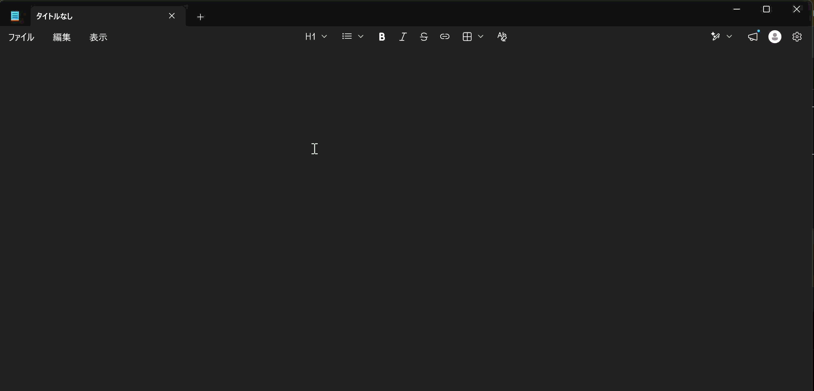
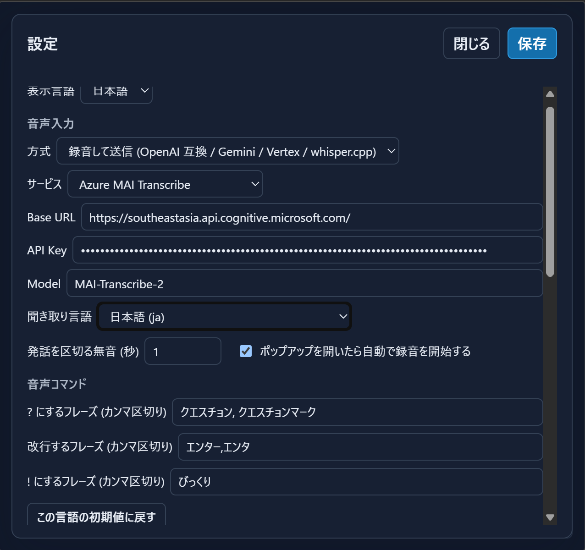
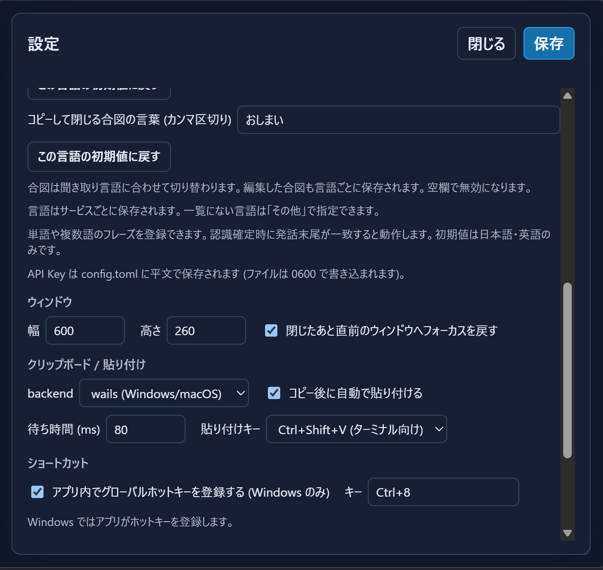

# speech-popup

[English](README.md) · [プライバシー](PRIVACY_ja.md)

Wails 製の常駐型 **音声入力ポップアップ**。ホットキーで呼び出して話すと、認識結果がクリップボードへ入り、直前のウィンドウへ貼り付けられます。Linux/Wayland (Hyprland)・Windows・macOS 対応。

[skk-popup](https://github.com/takeshy/skk-popup) の常駐ポップアップ／クリップボード連携の仕組みはそのまま、入力方式を SKK から音声認識に置き換えたものです。音声認識の実装は [gemihub-desktop](https://github.com/takeshy/gemihub-desktop) の音声入力機能を移植しています。

## デモ



[YouTube でデモを見る](https://youtu.be/CVzQ8gJrPJA) · [ポップアップの静止画を見る](docs/speech_popup_ja.png)

### 設定画面

<p>
  
  
</p>

## 使える音声認識サービス

既定は **ブラウザ音声認識 (`provider = "browser"`)** です。対応する WebView なら API Key や自前サーバーなしで利用できます。ただし音声認識のバックエンドを持つかは WebView 次第で、**WebKitGTK には無く、WebView2 でも動かない場合があります**。その場合はポップアップに理由と `設定を開く` ボタンが出るので、下表の録音方式へ切り替えてください。

| 方式 | 設定 | 備考 |
|---|---|---|
| OpenAI | `endpoint_type = "openai"` | `POST {base_url}/audio/transcriptions`。`whisper-1` / `gpt-4o-transcribe` など |
| OpenAI 互換 (自前ホスト) | `endpoint_type = "custom"` | 同上。Groq・LM Studio・vLLM など |
| whisper.cpp server | `endpoint_type = "whisper-cpp"` | `POST {base_url}/inference`。ローカルの平文 HTTP を許可。Model 不要 |
| Azure MAI Transcribe | `endpoint_type = "azure-mai-transcribe"` | Azure Speech API Key |
| Gemini API | `endpoint_type = "gemini-transcribe"` | `gemini-3.5-transcribe` に音声を inline で渡す。API Key |
| Vertex AI | `endpoint_type = "vertex-transcribe"` | `gemini-3.5-transcribe-preview`。Google OAuth (デスクトップクライアント JSON) |
| ブラウザ音声認識 | `provider = "browser"` | WebView の `SpeechRecognition`。逐次認識だが **WebKitGTK / WebView2 は非対応**。対応環境でのみ選択してください |

UI・設定・ヘルプ・トレイメニューは英語と日本語に対応し、設定の **表示言語 → English / 日本語** で選択し、保存すると即時に切り替わります。未設定時の初期値は WebView の優先言語から判定します（日本語なら日本語、それ以外は英語）。書き起こす音声の言語とは別の設定です。

音声は 16kHz モノラル WAV に変換してから送ります (WebM/Opus をデコードできないサーバーでも動くため)。録音は最長 5 分・20MB まで。

HTTP リクエストは WebView からではなく Go 側のプロキシ (`SpeechHTTPRequest`) を通ります。CORS を回避でき、API Key がプリフライトに乗ることもありません。Vertex AI だけは専用の `VertexSpeechHTTPRequest` を通り、OAuth アクセストークンは**固定のモデル・エンドポイント以外には決して付きません**。

## 動作要件

| OS | 必要なもの |
|---|---|
| Linux + Wayland (Hyprland 推奨) | `wl-clipboard` (`wl-copy`)、WebKit2GTK 4.1、任意で `wtype` (自動貼り付け時)、マイク (PipeWire/PulseAudio) |
| Windows 10 以降 | 追加要件なし (ホットキーはアプリ内登録) |
| macOS | **マイク**権限と、`osascript` が使う **Accessibility / Automation** 権限 |

Windows版は [Microsoft Storeからインストール](https://apps.microsoft.com/detail/9NVCCG9K20FV?hl=ja-jp&gl=JP&ocid=pdpshare) できます。

## 使い方

常駐すると**通知領域 (システムトレイ) にマイクのアイコン**が出ます。左クリックで表示/非表示、右クリックで `音声入力を開く` / `設定…` / `ヘルプ` / `終了`。ホットキーが登録できなかった場合でも、ここから設定に到達できます。

```text
speech-popup            デーモンを起動 (常駐)
speech-popup toggle     表示/非表示をトグル
speech-popup show       表示、または表示済みの入力欄へフォーカス
speech-popup hide       非表示
speech-popup quit       デーモン終了
speech-popup version    バージョン表示
```

1. ホットキー (既定 **`Ctrl+8`**) で入力窓を出す。`auto_start = true` (既定) なら**その瞬間から録音が始まります**
2. 話す。無音が `silence_seconds` 続くと発話を区切って認識し、録音はそのまま続きます。停止は `Ctrl+Space` / ● ボタンで行います
3. 認識結果がテキストエリアに入る。そのまま手で直せます
4. `Enter` (または Copy) → クリップボードにコピーして窓が閉じ、直前のウィンドウへ貼り付けられます
5. 最後に合図の言葉（初期値は聞き取り言語に連動。日本語は `おしまい`）を話すと、その語を除いて 3〜4 を自動で行います

デーモンは常駐するので 2 回目以降の表示は即時です。

### ホットキー (既定 `Ctrl+8`)

窓を呼び出すキーの既定は **`Ctrl+8`** です。**`8` の形がマイクに見える**ので覚えやすい、というのが選定理由です。

実用上の理由もあります。`Ctrl+Shift+S` のような「音声 = Speech」から連想しやすい英字の組み合わせは、Windows では OneDrive・ShareX・Snipping Tool などが先に `RegisterHotKey` で握っていることが多く、後から登録しようとすると**黙って失敗します** (エラーコード 1409)。数字キーはその競合を踏みにくい、という実利があります。

なお `RegisterHotKey` はシステム全体でそのキーを横取りするので、`Ctrl+8` を内部で使うアプリ (ブラウザの「8 番目のタブへ移動」など) は、常駐中そのキーを受け取れなくなります。困る場合は設定で変更してください。

- Linux/Hyprland: アプリは登録しません。`bind = CTRL, 8, exec, speech-popup show` を `hyprland.conf` に書きます (下記)
- Windows: アプリが `RegisterHotKey` で自動登録します
- macOS: OS 側のショートカット機能から `speech-popup show` を呼びます

### 窓の中のキー操作

- `Ctrl+Space` / ● 録音 — 録音の開始・停止 (停止で認識開始)
- `Ctrl+R` / 再認識 — 保持している録音をもう一度サーバーへ送る (通信エラーからの復帰用。録り直し不要)
- `Ctrl+D` — 保持している録音を破棄
- `Enter` — コピーして閉じる / `Shift+Enter` — 改行
- 編集 (`skk-popup` と同じ): `Ctrl+A/E` — 行頭/行末、`Ctrl+B/F` — 1文字左/右、`Ctrl+K/U` — 行末/行頭まで削除、`Ctrl+O` — 全選択
- `Ctrl+C/X/V` — コピー/切り取り/貼り付け、`Ctrl+Z` — 元に戻す、`Ctrl+Shift+Z` / `Ctrl+Y` — やり直す。`Ctrl+K` は行末で押すと改行を削除して次の行と連結
- `Ctrl+↑` / `Ctrl+↓` — テキスト履歴を移動 (最大 30 件。`Ctrl+↓` で下書きに戻る)
- `Escape` / `Ctrl+[` — 録音中なら中止 / それ以外は閉じる (コピーせず入力内容は次回まで保持)
- ⋮ メニュー — 設定 / ヘルプ

認識に失敗しても録音は保持されるので、`Ctrl+R` で同じ音声を再送できます。認識が成功すると保持分の録音は消費されます。コピーに成功した時点で入力内容と残りの録音を破棄します。

再送待ちの録音は、設定を開いたり API Key・接続先を修正したりしても保持されます。ただしブラウザ音声認識と録音方式の切り替え時には破棄され、アプリ終了後には残りません。

テキストのコピー履歴は `skk-popup` と同様に重複を除いて最新30件を保存し、再起動後も `Ctrl+↑` / `Ctrl+↓` で呼び出せます。ポップアップを開いた際の外部クリップボードも履歴へ取り込みます。次にポップアップを開くと、未コピーの入力内容も履歴へ保存して入力欄を空にします。保存した内容は `Ctrl+↑` / `Ctrl+↓` で取得できます。コピーも次回表示もしていない下書きは、アプリ終了時には消えます。

### Hyprland への登録

```ini
# ~/.config/hypr/hyprland.conf

windowrulev2 = float, class:^(speech-popup)$
windowrulev2 = center, class:^(speech-popup)$
windowrulev2 = pin, class:^(speech-popup)$
windowrulev2 = stayfocused, class:^(speech-popup)$
windowrulev2 = noborder, class:^(speech-popup)$
windowrulev2 = noanim, class:^(speech-popup)$

bind = CTRL, 8, exec, speech-popup show

exec-once = uwsm app -- speech-popup
```

- `stayfocused` が最重要です。これがないと窓が表示されてもキーボードフォーカスが移りません。
- 実際の `class` 名は `hyprctl clients` で確認してください。
- 設定画面の「ショートカット」でキーを入力すると、この `bind =` 行を生成してコピーできます。

### Windows

ホットキーはアプリ自身が `RegisterHotKey` で登録します (既定 `Ctrl+8`、`[hotkey]` で変更・無効化可能)。Store / MSIX 版はインストール・更新後に一度起動すると自動起動が登録され、次回サインインから常駐します。「設定 → アプリ → スタートアップ → speech-popup」で有効・無効を変更できます。以前に無効化した場合は同じ画面から再度有効にしてください。EXE 単体版はスタートアップフォルダ (`Win+R` → `shell:startup`) にショートカットを置いてください。

**ホットキーが効かないとき**は、`RegisterHotKey` が他アプリに先を越されている可能性が高いです。切り分けは次の順で:

```powershell
speech-popup.exe status        # デーモンの生死と config/log の実パス
speech-popup.exe show          # 窓が出る → ホットキー登録だけが失敗している
type "$env:AppData\speech-popup\speech-popup.log"   # 理由が残っている
```

Windows 版は `-H windowsgui` でビルドしているため OS はコンソールを与えません。CLI サブコマンドの出力が消えないよう、起動時に `AttachConsole(ATTACH_PARENT_PROCESS)` で呼び出し元のコンソールへ繋ぎ直しています (`console_windows.go`)。PowerShell は GUI サブシステムの exe を待たないので、**プロンプトが戻ったあとに出力が表示される**ことがあります。

Microsoft Store 版はパッケージ内の EXE をパス指定で起動できませんが、`speech-popup.exe` をアプリ実行エイリアスとして登録しているため、上記のコマンドは PowerShell・ショートカット・他アプリからそのまま使えます。エイリアスはインストール/更新時に Windows が作成します (拡張子なしの `speech-popup` でも PATHEXT により解決されます)。

ログには `hotkey: registered Ctrl+8` か、失敗理由 (`...1409` = 既に登録済み) が出ます。登録に失敗している場合は窓の下部にも赤字で表示され、**⋮ → 設定 → 情報**の「ホットキー」欄で現在の状態を確認できます。別のキー (`Ctrl+Alt+S` など) に変えて保存すれば、その場で再登録されます。

### macOS

キーボードショートカットは OS 側に委譲します: [Shortcuts.app](https://support.apple.com/guide/shortcuts-mac/intro-to-shortcuts-apdfebc4f80a/mac) で「シェルスクリプトを実行」→ `speech-popup show` を作り、キーを割り当ててください (skhd / Raycast / Hammerspoon でも可)。

初回実行時に**マイク**、および自動貼り付け・フォーカス復帰のための **Accessibility / Automation** 権限を求められます。設定の `paste_key` の `ctrl` は **Cmd** として扱われます。

## 設定

Linux: `~/.config/speech-popup/config.toml` / Windows: `%AppData%\speech-popup\config.toml` / macOS: `~/Library/Application Support/speech-popup/config.toml`

**⋮ → 設定** で同じ内容を GUI から編集できます。保存すると `config.toml` が書き換わり、**すべての設定が再起動なしで反映されます**。

```toml
[window]
width = 600
height = 300
# 閉じたあとに直前のウィンドウへフォーカスを戻す
restore_focus = true

[speech]
# "browser" (WebView の音声認識、既定) | "openai-compatible" (録音して STT へ POST)
provider = "browser"
# "openai" | "whisper-cpp" | "custom" | "gemini-transcribe" | "vertex-transcribe"
endpoint_type = "openai"
base_url = "https://api.openai.com/v1"
# 平文で保存される (config.toml は 0600 で書き込まれる)。vertex-transcribe では未使用
api_key = ""
model = "whisper-1"
# BCP-47 (ja / en / ja-JP ...) もしくは "auto"
language = "auto"
# 無音がこの秒数続いたら発話を区切って変換する。録音は継続 (0 で無効)
silence_seconds = 3
# 認識結果の末尾がこの語なら、その語を除いてコピーして閉じる (カンマ区切り)
send_phrase = "おしまい"
# vertex-transcribe で使う Google Cloud プロジェクト ID
vertex_project_id = ""
# ポップアップを開いた直後に録音を開始する
auto_start = true

[clipboard]
# "wl-copy" | "wails" (既定: Linux=wl-copy, Windows/macOS=wails)
backend = "wl-copy"
# コピー後に自動で貼り付けショートカットを送出 (Linux: wtype, Windows: SendInput, macOS: osascript)
auto_paste = true
# 自動貼り付け時、フォーカス復帰から送出までの待ち時間 (ミリ秒)
auto_paste_delay_ms = 80
# "ctrl+v" | "ctrl+shift+v"
# foot/alacritty/kitty などの多くのターミナルは Ctrl+V を readline の「次の文字を
# リテラル入力」に使うため、貼り付けには ctrl+shift+v が必要。
paste_key = "ctrl+shift+v"

[hotkey]
# Windows のみ有効。アプリ内でグローバルホットキーを登録する (RegisterHotKey)。
# 既定は Windows のみ true (Linux は Hyprland bind、macOS は OS のショートカット
# 機能に委譲するため、他 OS では設定しても無視される)
enabled = true
accelerator = "Ctrl+8"   # A-Z, 0-9, F1-F24 + Ctrl/Shift/Alt/Win   # A-Z, 0-9, F1-F24 + Ctrl/Shift/Alt/Win
```

### サービスごとの設定の記憶

**Base URL・API Key・Model・言語・Vertex のプロジェクト ID** はサービスごとに記憶し、切り替えると前回の値を復元します。初めて選ぶサービスには初期値が入り、キーは空欄になります。**保存**すると全サービスの設定が `config.toml` に保存され、アプリ再起動後も保持されます。保存せず閉じた変更は破棄されます。無音秒数・自動録音は共通設定です。

**聞き取り言語**はサービス別のプルダウンで選びます。言語名は表示言語と現地語を併記します。OpenAI は Whisper の公開言語候補、whisper.cpp は言語カタログ、Gemini/Vertex は地域付きのコード、Azure MAI はモデル別の言語候補を使用します。ブラウザや自前ホストで実際に使える言語は接続先・モデルに依存します。一覧にない言語は **その他（言語コード指定）** で入力でき、既存の言語コードも保持されます。HTTP サービスでは自動検出も選べます。ブラウザでは WebView の言語を使う選択肢になります。

**音声コマンド**は **?・改行・!・コピーして閉じる** の4種類です。フレーズは聞き取り言語ごとに記憶し、言語やサービスを切り替えると復元します。初期値を用意するのは日本語（クエスチョン／クエスチョンマーク、エンター、びっくり、おしまい）と英語（question／question mark、enter、exclamation、over）だけです。ほかの言語は空欄から設定でき、既存の保存済みフレーズは保持します。

単語でも複数語のフレーズでも登録できます。認識表記に合わせ、たとえば `se acabo, se acabó` のようにカンマ区切りで複数の候補を指定します。各欄を空にするとその動作を無効にできます。リセットボタンで現在の言語の初期値に戻せます。同じフレーズを複数の動作には設定できません。**保存**すると無効化も含めて再起動後に復元します。同じ言語ならサービスや地域をまたいで共通です（繁体字中国語は別）。聞き取り言語が自動検出の場合は WebView の優先言語を使い、認識結果ごとには切り替えません。

### whisper.cpp をローカルで使う

```sh
# whisper.cpp 付属のサーバーを起動
./build/bin/whisper-server -m models/ggml-large-v3-turbo.bin --host 127.0.0.1 --port 8080
```

設定で サービス = `whisper.cpp server` / Base URL = `http://127.0.0.1:8080` にします (Model は不要)。ローカル宛の平文 HTTP は許可されますが、リンクローカルアドレス (169.254.0.0/16, fe80::/10) はメタデータエンドポイント対策で常に拒否されます。

### Azure MAI Transcribe を使う

1. **MAI Transcribe** に対応するリージョンで Azure Speech / Foundry リソースを作成します。[対応リージョン表](https://learn.microsoft.com/ja-jp/azure/ai-services/speech-service/regions)の **LLM speech** タブを確認してください。通常の音声認識に対応するリージョンでも、MAI が使えるとは限りません。
2. 設定で録音方式を選び、サービスを **Azure MAI Transcribe** にします。
3. そのリソースのエンドポイントとキーを入力して保存します。

| 設定 | 例・動作 |
|---|---|
| Base URL | Southeast Asia のリソースなら `https://southeastasia.api.cognitive.microsoft.com/`、またはリソース固有の `https://your-resource.cognitiveservices.azure.com/` |
| API Key | 同じリソースのキー。URL だけを変更しても既存リソースのリージョンは変わりません |
| Model | `MAI-Transcribe-2` (初期値)。`MAI-Transcribe-1.5` も指定できます |
| 言語 | `auto` で自動検出、`ja` で日本語指定。日本語のコードは `jp` ではありません |

Base URL に API のパスやクエリは付けません。アプリが [MAI Transcribe API](https://learn.microsoft.com/ja-jp/azure/ai-services/speech-service/mai-transcribe) のパスと API バージョン `2025-10-15` を付加します。言語が `auto` なら `locales` を省略し、`ja` なら `locales: ["ja"]` を送信します。

#### 認識できないとき

- **HTTP 400 / モデル指定の拡張モードが未対応**：リソースのリージョンとエンドポイントが MAI に対応しているか確認してください。実測では Japan East のエンドポイントで通常の高速文字起こしは成功しましたが、MAI 指定は拒否されました。Southeast Asia では `MAI-Transcribe-2` で音声の文字起こしを確認しています。
- **「音声を認識できませんでした」**：サービスが空の認識結果を返した場合に表示します。言語設定が原因とは限りません。声に合わせて音量メーターが動くか確認し、**発話を区切る無音 (秒)** を **0** にして保存してください。5秒程度話し、Ctrl+Space で手動停止すると、自動分割の影響を切り分けられます。
- **設定変更後の再試行**：Ctrl+R は保持している音声を保存済みの設定で再送します。無音秒数を変更しても、保持済み音声の区切りは変わりません。新しく録音して試す場合は、保持済み音声が不要なら先に Ctrl+D で破棄してください。

手動録音で認識できたら、自動分割を使う場合は **3秒程度**から試してください。0秒では自動分割が無効になります。音声による記号・改行の変換は、手動停止時も動作します。

### Vertex AI を使う

1. Google Cloud で「デスクトップアプリ」タイプの OAuth クライアントを作り、JSON をダウンロード
2. 設定 → サービス = `Vertex AI` → **JSON を選択して Google に接続** → JSON を選択 → ブラウザで認可
3. 設定を保存。プロジェクト ID は JSON から自動取得するため、入力は不要です。

プロジェクト ID は OAuth 接続と一緒に保存され、設定の再表示やサービス切り替え時に復元されます。OAuth 認証情報は設定ディレクトリ内の `credentials/vertex-oauth.json` に 0600 で保存され、サービス切り替え・アプリ再起動後も保持されます。アクセストークンの期限が近づくと、保存したリフレッシュトークンで自動更新します。**接続を解除**すると Google 側への失効リクエストを試み、ローカルの認証情報を削除します。

## データファイル

| ファイル | Linux | Windows | macOS |
|---|---|---|---|
| コピー履歴 (`history.json`) | `$XDG_DATA_HOME/speech-popup/` | `%LocalAppData%\speech-popup\` | `~/Library/Application Support/speech-popup/` |
| Vertex OAuth 認証情報 | `~/.config/speech-popup/credentials/` | `%AppData%\speech-popup\credentials\` | `~/Library/Application Support/speech-popup/credentials/` |
| ログ (`speech-popup.log`) | `~/.config/speech-popup/` | `%AppData%\speech-popup\` | `~/Library/Application Support/speech-popup/` |

デーモンは Windows では `-H windowsgui`、他 OS でも切り離して起動されるため標準エラー出力が誰にも見えません。起動時のログ (ホットキー登録の成否など) は上記ファイルにも書かれます (1MB を超えたら切り詰め)。

書き込みは最終更新 2 秒後にデバウンスフラッシュされ、窓を閉じるタイミングでも必ずフラッシュされます。

## 自前でビルドする

前提:

- Go 1.25 以降 (`.mise.toml` を同梱)
- Node.js 22 以降 (フロントエンドのコピーとテストのみ。バンドラは使いません)
- Linux のみ: `libgtk-3-dev` と `libwebkit2gtk-4.1-dev` 相当 (Arch なら `webkit2gtk-4.1`)

```sh
go install github.com/wailsapp/wails/v3/cmd/wails3@v3.0.0-beta.12
wails3 task linux:build ARCH=amd64       # Linux
# wails3 task windows:build ARCH=amd64   # Windows
# wails3 task darwin:build ARCH=arm64    # macOS
install -Dm755 bin/speech-popup ~/.local/bin/speech-popup
```

Linux ビルドは Wails v3 の `gtk3` タグを使い、WebKit2GTK 4.1 環境との互換性を維持します。

## テスト

```sh
go test ./...              # 設定・履歴ストア・HTTP プロキシ・Vertex ガード
node --test tests/*.test.js  # 認識リクエストの組み立て・WAV 生成・無音検出
```

### 挿入位置と句読点

認識結果は現在のカーソル位置に挿入します。範囲を選択していれば置き換え、後ろの文章は残します。録音中にカーソルを動かすと、次の結果からその位置に入ります。元に戻す操作では選択範囲も復元します。ブラウザ認識の途中結果は同じ位置で更新し、カーソルを動かした場合は表示済みの結果を保持して、新しい発話から新しい位置に挿入します。

認識サービスが返した `。`・`、` などの句読点は基本的にそのまま残します。ただし `!`・`?`（全角・アラビア語の疑問符も含む）の直前の句点（`。`・`.`・`．`・`۔`・`।`・`॥`・`։`）は除きます。別の発話で記号を追加した場合も、カーソル直前の句点を置き換えます（改行はまたぎません）。設定した音声コマンドは認識確定時の発話末尾にだけ一致します。手動停止や無音設定が0秒の場合も動作します。改行コマンドはコピー・送信をせずに改行を挿入し、コピーして閉じる合図はほかの変換より優先されます。現在の聞き取り言語に設定したフレーズだけが有効です。「改行」「new line」なども、自分で登録しない限り普通の文章として扱います。Shift+Enter でも改行できます。

録音方式では無音で録音を区切って送信し、前の発話を認識している間も録音を続けます。短い発話が次の文まで溜まらないよう、音量が250ミリ秒途切れず続くことを要求する条件は廃止しました。100ミリ秒以上離れた2回の音量検出が300ミリ秒以内なら発話とみなし、その後に設定した無音秒数が経過すると送信します。待ち時間が0になったわけではありません。単語だけで反応しない場合は、Ctrl+Spaceで手動停止して送信すると、無音判定と認識サービスの影響を切り分けられます。認識精度はサービスにも依存します。

改行や折り返しで入力内容が増えるとウィンドウが広がり、画面の作業領域内まで拡大します。それ以上は入力位置が見えるように入力欄内をスクロールします。内容を減らすと設定した高さまで縮みます。自動調整で保存済みのサイズ設定は変更しません。

設定は保存に成功すると閉じます。録音開始から2秒以内に停止した録音は、認識サービスへ送らず破棄します。設定画面を開くと録音を停止し、設定画面を閉じても自動では再開しません。

### GitHub Release

`vMAJOR.MINOR.PATCH` タグをpushすると、skk-popupと同じ方針の **Release** ワークフローが動きます。Linux amd64/arm64・macOS arm64・Windows amd64/arm64 をビルドし、Store用変数が両方設定されていればWindowsのMSIXも生成します。全ビルド成功後、成果物と自動生成のリリースノートを添付した **ドラフトのGitHub Release** を作成します。公開はドラフトを確認してから行ってください。Microsoft Storeへの申請は行いません。

既存タグにも対応しています。**Actions → Release → Run workflow** で `main` を選び、タグ (例: `v0.3.0`) を入力します。そのタグのソースをビルドし、`wails.json` のバージョンとの一致を確認したうえで、同じタグのReleaseに成果物を添付します。**Windows packages** はWindowsのみを手動ビルドする用途で残り、ActionsのArtifactsを生成しますがReleaseは作成しません。
